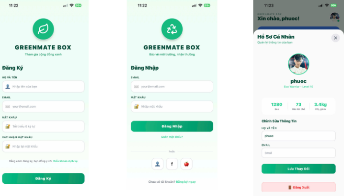
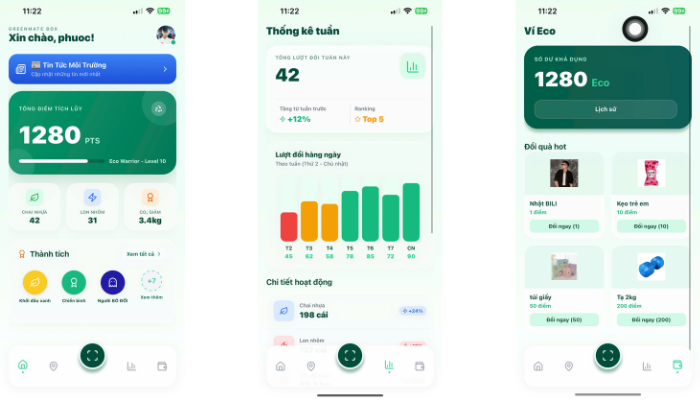
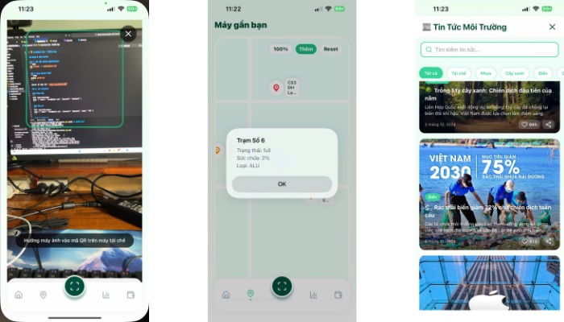

# 🌱 GreenMate Box - Smart Recycling Platform

> **Tái chế thông minh, bảo vệ hành tinh** 🌍

GreenMate Box là một ứng dụng di động và web tích hợp, giúp người dùng tái chế rác thải một cách thông minh, kiếm điểm thưởng, và đóng góp cho bảo vệ môi trường.

## 📱 Ảnh Giao Diện

### 1️⃣ Đăng Nhập & Đăng Ký

*Giao diện đăng nhập/đăng ký với thiết kế gradient xanh lá sang trọng, hỗ trợ đăng ký nhanh qua Facebook/Google*

### 2️⃣ Chức Năng Chính

*Dashboard chính với quét QR, quản lý điểm, thống kê, ví điểm, bản đồ máy, và huy hiệu thành tích*

### 3️⃣ Tin Tức Môi Trường

*Trang tin tức môi trường cập nhật hàng ngày, hỗ trợ tìm kiếm, lọc danh mục, và lưu yêu thích*

---

## ✨ Tính Năng Chính

### 🔐 Xác Thực & Tài Khoản
- ✅ **Đăng nhập/Đăng ký** với email và mật khẩu
- ✅ **Quản lý session** an toàn (HTTPOnly cookies, 7 ngày tự động hết hạn)
- ✅ **Hồ sơ cá nhân** có thể chỉnh sửa
- ✅ **Đăng xuất** an toàn với xóa session server-side

### 📱 Quét QR & Tích Lũy Điểm
- 📸 **Quét mã QR** bằng camera di động
- 💰 **Tính điểm tự động** dựa trên loại rác:
  - Chai nhựa (PET): +10 điểm
  - Chai thủy tinh: +15 điểm
  - Lon nhôm (ALU): +20 điểm
- 🌍 **Tính toán CO₂ tiết kiệm**: ~0.3kg CO₂/chai
- 📊 **Thống kê giao dịch** realtime

### 🎯 Huy Hiệu & Thành Tích
**10 huy hiệu bao gồm:**
- 🌱 **Eco Starter** - Tái chế 10+ chai
- ⚡ **Green Warrior** - Tái chế 100+ chai
- 🏆 **Zero-Waste** - Tái chế 500+ chai
- 🌍 **Earth Guard** - Giảm 10kg CO₂
- 💎 **Point Master** - Tích lũy 500+ điểm
- 🎖️ **Recycle Pro** - Tái chế 50+ chai
- 👑 **Eco King** - Tích lũy 1000+ điểm
- 🌳 **Tree Lover** - Giảm 50kg CO₂
- 🚀 **Super Saver** - Tái chế 200+ chai
- ⭐ **Siêu sao Eco** - Đứng top 1 BXH

### 💰 Ví Điểm & Đổi Quà
- 🎁 **Đổi điểm lấy quà**: Bình nước tre, túi Canvas, thẻ xe bus, tạ...
- 📜 **Lịch sử giao dịch** chi tiết với timestamp
- 💳 **Quản lý số dư** Eco Points

### 📊 Thống Kê & BXH
- 📈 **Biểu đồ chai/ngày** - Tracking tiến độ hàng ngày
- 🌍 **Biểu đồ CO₂ tiết kiệm** - Giám sát tác động môi trường
- 🏅 **Bảng xếp hạng** - So sánh với người dùng khác (Top 10)
- 📉 **Phân tích chi tiết** theo loại rác

### 🗺️ Bản Đồ Máy Rác
- 📍 **Định vị máy gần nhất** trên bản đồ tương tác
- 🎮 **Zoom & kéo** bản đồ bằng gesture
- 📌 **Thông tin máy**: tên, địa chỉ, khoảng cách, trạng thái (hoạt động/đầy/bảo trì)
- 🔄 **Thêm vị trí mới** động

### 📰 Tin Tức Môi Trường
- 📢 **6 bài tin mẫu** về tái chế, nhựa, cây xanh, biển, công nghệ, cộng đồng
- 🔍 **Tìm kiếm** theo tiêu đề/nội dung
- 🏷️ **Lọc theo danh mục** (7 danh mục)
- ❤️ **Lưu yêu thích** bài viết
- 📤 **Share** trên mạng xã hội
- 📷 **Hình ảnh** chất lượng cao cho mỗi bài

### 🎨 Giao Diện & UX
- 🌈 **Gradient đẹp** với theme xanh lá
- 🎭 **Glass morphism** - hiệu ứng kính mờ sang trọng
- ✨ **Animations** mượt mà (fade-in, slide, shimmer)
- 📱 **Responsive design** cho mọi kích thước màn hình
- 🌙 **Dark mode ready** (có thể thêm)

---

## 🏗️ Kiến Trúc Hệ Thống

### 📐 Frontend - React Native (Mobile)

**Công nghệ:**
- React Native + Expo
- expo-camera (QR scanning)
- expo-linear-gradient (UI)
- lucide-react-native (Icons)

**Thành phần chính:**
```
App.js
├── renderLogin()          # Đăng nhập
├── renderSignup()         # Đăng ký
├── renderDashboard()      # Trang chủ + tin tức
├── renderScan()           # Quét QR
├── renderWallet()         # Ví điểm
├── renderStats()          # Thống kê
├── renderMap()            # Bản đồ
├── renderProfile()        # Hồ sơ cá nhân
└── news.js               # Trang tin tức
```

**State Management:**
- `points` - Điểm tích lũy
- `bottles` - Chai tái chế
- `cans` - Lon nhôm tái chế
- `co2` - CO₂ giảm (kg)
- `activeTab` - Tab hiện tại
- `showNews` - Hiển thị tin tức
- `walletHistory` - Lịch sử giao dịch
- `userData` - Thông tin user

### 🖥️ Backend - Flask (Python)

**Công nghệ:**
- Flask 2.x
- Flask-CORS
- Session management
- JSON persistence

**API Endpoints:**

| Method | Endpoint | Mô Tả |
|--------|----------|-------|
| POST | `/api/auth/login` | Đăng nhập |
| POST | `/api/auth/signup` | Đăng ký tài khoản |
| GET | `/api/auth/user` | Lấy info user (check session) |
| POST | `/api/auth/logout` | Đăng xuất (clear session) |
| GET | `/api/health` | Kiểm tra server |

**File quản lý:**
- `users.json` - Database user
- `logs.txt` - Log hoạt động
- `server.py` - Flask app

### 🌐 Frontend - Web (HTML/CSS/JS)

**Trang:**
- `login.html` - Đăng nhập/đăng ký
- `index.html` - Dashboard & các chức năng chính
  - Trang chủ (Home)
  - Ví điểm (Wallet)
  - Thống kê (Stats)
  - Lịch sử (History)
  - Bản đồ (Map)
  - Hồ sơ (Profile)

**Công nghệ:**
- Tailwind CSS
- Vanilla JavaScript
- Fetch API (gọi backend)
- LocalStorage (lưu dữ liệu cục bộ)

---

## 📊 Luồng Dữ Liệu

### Đăng Nhập Flow
```
User Input (email, password)
    ↓
POST /api/auth/login
    ↓
Backend: Validate credentials
    ↓
Server: Set session cookie (7 days)
    ↓
Frontend: Save user data, redirect /home
    ↓
Show Dashboard
```

### Quét QR Flow (Mobile)
```
User: Nhấn "Quét"
    ↓
Camera: Open
    ↓
QR Detection: Parse data
    ↓
Calculate: points, bottles, co2
    ↓
Update State: points += earned
    ↓
Show Feedback + Toast
    ↓
Add to walletHistory
```

### Tin Tức Flow
```
NewsScreen Mount
    ↓
Load 6 news articles
    ↓
User: Tìm kiếm / Lọc danh mục
    ↓
Filter: match title, description, category
    ↓
Render: Filtered news
    ↓
User: Lưu yêu thích (toggle saved)
```

---

## 🚀 Cài Đặt & Chạy

### Prerequisites
- Node.js 16+
- Python 3.8+
- Expo CLI
- React Native environment

### Mobile (React Native)
```bash
# Cài đặt dependencies
npm install

# Chạy ứng dụng
expo start

# Chọn iOS hoặc Android
```

### Backend (Flask)
```bash
# Cài đặt dependencies
pip install -r requirements.txt

# Chạy server
python server.py

# Server sẽ chạy ở http://localhost:5000
```

### Web (HTML/CSS/JS)
```bash
# Copy templates/ vào static folder hoặc serve qua Flask
# Truy cập http://localhost:5000 trên browser
```

---

## 📁 Cấu Trúc Thư Mục

```
.
├── App.js                    # Main mobile app (React Native)
├── news.js                   # News screen component
├── server.py                 # Flask backend
├── package.json              # Node dependencies
├── requirements.txt          # Python dependencies
│
├── templates/
│   ├── login.html           # Web login/signup
│   └── index.html           # Web dashboard
│
├── assets/
│   └── imgage/
│       ├── bao.png          # User avatar
│       ├── logo.png         # App logo
│       ├── nhat.png         # Gift image
│       ├── keo.jpg          # Gift image
│       ├── tuiqua.png       # Gift image
│       └── ta.jpg           # Gift image
│
├── app_gmb/
│   ├── 1.png               # Login/Signup screenshot
│   ├── 2.png               # Features screenshot
│   └── 3.png               # News screenshot
│
├── users.json              # User database
├── logs.txt               # Activity logs
└── README.md              # This file
```

---

## 🔐 Bảo Mật

- 🔒 **Session Security**: HTTPOnly cookies (không thể truy cập qua JS)
- ⏰ **Timeout**: Session tự động hết hạn sau 7 ngày
- 🛡️ **CORS**: Kiểm soát cross-origin requests
- 📝 **Logging**: Tất cả hoạt động được ghi lại
- 🔑 **Password**: Lưu trữ plaintext (khuyến nghị hash với bcrypt)

---

## 📈 Sở Thích Tiếp Theo

- [ ] Hash mật khẩu (bcrypt)
- [ ] Database: MongoDB hoặc PostgreSQL
- [ ] Push notifications
- [ ] Chia sẻ kết quả trên social media
- [ ] Offline mode
- [ ] Multi-language support
- [ ] Dark mode
- [ ] Real-time notifications
- [ ] Gamification (level, rank, leaderboard live)
- [ ] Integration với các tổ chức môi trường

---

## 👥 Đội Ngũ

- **Developer**: HanBao
- **Project**: GreenMate Box

---

## 📄 License

MIT License - Tự do sử dụng, sửa đổi và phân phối.

---

## 💡 Cách Hoạt Động

### Cho Người Dùng
1. 📱 **Tải & cài đặt** app từ Expo
2. 🔐 **Đăng ký tài khoản** mới hoặc **đăng nhập**
3. 📸 **Quét QR code** trên máy rác thải
4. 💰 **Nhận điểm** tự động
5. 🎁 **Đổi điểm lấy quà** hoặc **xem thống kê**
6. 📰 **Đọc tin tức** môi trường hàng ngày
7. 🏆 **Mở khóa huy hiệu** thông qua hoàn thành thách thức

### Cho Quản Trị Viên
1. 📊 **Kiểm tra logs** hoạt động user
2. 👥 **Quản lý tài khoản** trong `users.json`
3. 📈 **Phân tích dữ liệu** về tái chế
4. 📝 **Cập nhật tin tức** (sẽ thêm admin panel)

---

## 📞 Hỗ Trợ

Nếu có vấn đề, vui lòng:
1. Kiểm tra logs trong `logs.txt`
2. Đảm bảo server Flask đang chạy
3. Kiểm tra kết nối mạng
4. Liên hệ: [support@greenmate.local]

---

## 🌍 Tầm Nhìn

**"Một thế giới nơi mọi người đều tham gia bảo vệ môi trường thông qua những hành động nhỏ hàng ngày."**

Với GreenMate Box, chúng tôi muốn:
- 🌱 Khuyến khích tái chế
- 🌍 Giảm lượng rác thải toàn cầu
- 👥 Xây dựng cộng đồng xanh
- 🏆 Ghi nhận những nỗ lực của mỗi người
- 📚 Nâng cao nhận thức môi trường

---

**Tái chế hôm nay, bảo vệ ngày mai! 🌿**

Made with 💚 by GreenMate Team


## 📁 Cấu Trúc Project

```
myapp/
├── App.js              # Main React Native App
├── app.json            # Config
├── package.json        # Dependencies
├── server.py           # Python Flask Server
├── requirements.txt    # Python dependencies
├── assets/
│   └── imgage/         # Images
└── README.md           # This file
```

## ✨ Tính năng

- ✅ Đăng nhập / Đăng ký
- ✅ Trang chủ với thống kê
- ✅ Quét QR rác thải
- ✅ Ví Eco với lịch sử
- ✅ Bảng xếp hạng
- ✅ Bản đồ máy gần nhất
- ✅ Huy hiệu/Thành tích

## 🚀 Chạy App

```bash
npm start android
# hoặc
npx expo start
```

Sau đó chọn platform (iOS/Android)

---

**Made with 💚 for environment**
